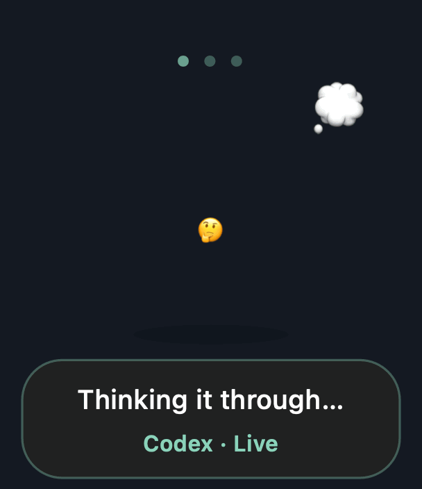
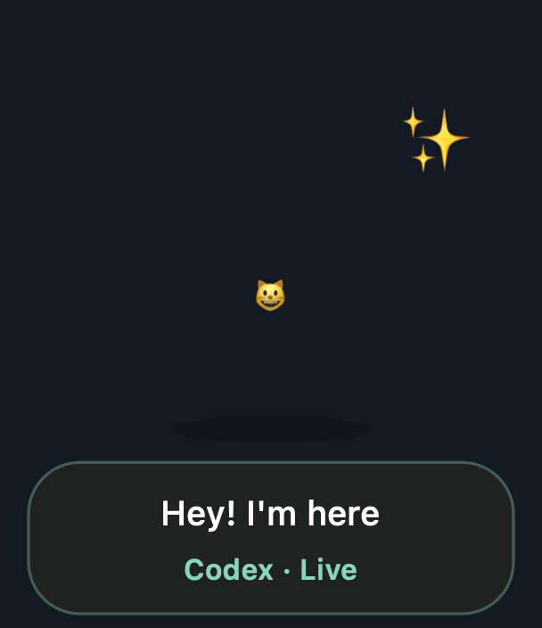

# Actor 🐣

A tiny animated emoji companion for **macOS**, floating beside Codex.
Uses native Apple emoji, AppKit animation, and local activity signals. No server,
API key, screenshot access, or network connection required.

> **This branch carries the experimental cross-platform shell.** The shipping app is
> the AppKit one on [`main`](https://github.com/mojtaba-borzu/actor-ai/tree/main).
> Everything below describes that app; [Cross-platform shell](#cross-platform-shell)
> covers what this branch adds and what it still cannot do.



## Install

```sh
git clone https://github.com/mojtaba-borzu/actor-ai
cd actor-ai
python3 scripts/install.py
```

Requires macOS 13+ and Xcode Command Line Tools (`swiftc` and `/usr/bin/python3`).
Builds `~/Applications/Actor.app`, starts it and registers launch at login. It does
not change any coding-app configuration.

Actor is compiled on your own machine from the source in this repository, so there
is no prebuilt binary to trust and no Gatekeeper warning to click past. Everything
it reads stays local; see [What is live](#what-is-live).

The background app shows its buddy when Codex / ChatGPT is open, or when
recent local coding events arrive. It hides when neither condition applies.
Open Actor once manually if you quit it before opening a coding app.

- **Drag** to choose a position; “Follow app position” restores automatic placement.
- **Click** for a heart. **Right-click** or use the menu bar emoji for settings.
- **Cat mood** changes the emoji palette.
- **Try a mood / Play all moods** previews animations, visibly labeled **Demo**.
- **Return to live** ends preview. Single previews expire after ten seconds.
- **Gentle motion** stops animation; macOS Reduce Motion is also respected.

| Mood | Meaning |
|---|---|
| 👋 | Arrival / goodbye |
| 🐣 | Ready |
| 🤔 | Thinking / reading |
| 🧑‍💻 | Editing / writing |
| 🛠️ | Calling a tool |
| 🥺 | Waiting for input or permission |
| 😵‍💫 | Reported failure |
| 🥳 | Turn completed |
| 😴 | Resting after inactivity |

Cat mood swaps the palette. Every mood, in order:



## What is live

**Codex:** reads local JSONL lifecycle/tool events from `$CODEX_HOME/sessions`
(default `~/.codex/sessions`). It tails recent files incrementally and never saves
conversation content. This works with the installed desktop build without changing
Codex config or requiring hook trust. The format is internal and may change.
Only observable states are shown: permission requests and tool-result failures
are **not reliably available** in these rollouts, so those Codex moods are currently
preview-only unless explicit error events arrive. Thinking is inferred between tools.

Auto mode follows the foreground supported app. For multiple Codex sessions, the
most recently observed prompt owns the state; activity in background sessions does
not continually steal focus. The initial focus search is bounded to 8 MB per recent
file, falling back to session creation time for older prompts. Exact selected-task
tracking inside the desktop UI is not exposed. Ten minutes without an activity
signal becomes “No recent signal”, never a false success. Status under the emoji
reads **Live**, **Ready** or **Demo**; the menu shows the event source.

State files contain only provider, mood, and timestamps under
`~/Library/Application Support/Actor`. Nothing is sent over the network.

## Develop / remove

```sh
./scripts/build.sh
python3 -m unittest discover -s tests -v
./tools/make-gif.sh Codex assets/demo.gif emoji demo
python3 scripts/install.py --uninstall
```

The demo GIFs are rendered by the app's own `draw()`, so they cannot drift from
what ships. `make-gif.sh` takes a provider label, an output path, `emoji` or
`cat`, and `demo` or `all`.

Uninstall removes only Actor's app and launch agent. It leaves small status files.

Integration reference: [Codex hooks and trust model](https://developers.openai.com/codex/hooks).

## Cross-platform shell

`proto/tauri/` is a Rust and Tauri v2 window that renders the same moods in a webview,
so Windows and Linux do not need the AppKit view rewritten. It is a prototype: you run
it from source, there is no packaged installer, and nothing registers it to start at
login yet.

It is always **two processes**, and you start both:

| Process | Job |
|---|---|
| `app/bridge.py` | Reads Codex session files, writes `status.json` |
| the shell | Reads `status.json`, draws the buddy |

The macOS app on `main` spawns the bridge itself (`app/Actor.swift:219`). The shell does
not do that yet, so it needs its own terminal.

The data paths now line up on all three platforms, but the shell has only really been
run on macOS. **Treat the Windows and Linux steps as untested.**

### macOS

Needs a Rust toolchain and the `python3` that ships with macOS 13+.

```sh
curl --proto '=https' --tlsv1.2 -sSf https://sh.rustup.rs | sh
git clone -b tauri-shell https://github.com/mojtaba-borzu/actor-ai
cd actor-ai
```

First terminal — the bridge:

```sh
python3 app/bridge.py
```

Second terminal — the buddy:

```sh
cd proto/tauri
cargo run
```

### Windows

Needs three things before the clone:

- **Rust** from [rustup.rs](https://rustup.rs), which pulls in the MSVC toolchain. If it
  asks, install the Visual Studio Build Tools workload it names — Tauri cannot link without it.
- **WebView2 runtime**, already present on Windows 11 and on updated Windows 10.
- **Python 3.9+** from [python.org](https://www.python.org/downloads/) or the Microsoft Store.
  The bare `python3` command is a Store stub on Windows, so use `python`.

```powershell
git clone -b tauri-shell https://github.com/mojtaba-borzu/actor-ai
cd actor-ai
```

First PowerShell window — the bridge:

```powershell
python app\bridge.py
```

Second PowerShell window — the buddy:

```powershell
cd proto\tauri
cargo run
```

### Linux

Needs the Tauri v2 system libraries as well as Rust and Python. On Debian and Ubuntu:

```sh
sudo apt install libwebkit2gtk-4.1-dev build-essential curl wget file libxdo-dev   libssl-dev libayatana-appindicator3-dev librsvg2-dev python3
curl --proto '=https' --tlsv1.2 -sSf https://sh.rustup.rs | sh
```

Other distributions are listed under
[Tauri prerequisites](https://v2.tauri.app/start/prerequisites/). Then:

```sh
git clone -b tauri-shell https://github.com/mojtaba-borzu/actor-ai
cd actor-ai
```

First terminal — the bridge:

```sh
python3 app/bridge.py
```

Second terminal — the buddy:

```sh
cd proto/tauri
cargo run
```

A transparent, undecorated, always-on-top window depends on the compositor. Expect it to
behave on GNOME and KDE with compositing on, and to look wrong on a bare window manager.

### Where things live

| | State written and read | Codex sessions read |
|---|---|---|
| macOS | `~/Library/Application Support/Actor/status.json` | `~/.codex/sessions` |
| Windows | `%APPDATA%\Actor\status.json` | `%USERPROFILE%\.codex\sessions` |
| Linux | `~/.local/share/Actor/status.json` | `~/.codex/sessions` |

`$XDG_DATA_HOME` overrides the Linux directory and `$CODEX_HOME` overrides the session
directory everywhere. `data_root()` in `app/bridge.py` and `data_dir()` in
`proto/tauri/src/main.rs` have to agree — if they ever drift, the window opens and never
receives a state.

### Did it work

The bridge writes `status.json` within a second of starting, so the file appearing is the
first thing to check. The caption under the buddy then reads `Codex · Local events` once a
Codex session is running. If it stays on `Waiting for agent`, the bridge is not writing
where the shell is looking; if the window never appears at all, read the `cargo run` output
rather than guessing.

Stop the buddy with **Quit Actor** in its right-click menu, and the bridge with Ctrl+C.
Nothing is installed anywhere, so there is nothing to uninstall — delete the clone and the
state directory from the table above.

### Notes for working on it

Tauri v2 grants no permissions by default; `capabilities/default.json` is what lets the
window listen for events, drag and resize itself. Dragging starts past a 4 px threshold
rather than through `data-tauri-drag-region`, which keeps click-for-a-heart alive the way
the AppKit view does. Transparency relies on `macOSPrivateApi`, which rules out the Mac
App Store.

`tools/build-renderer.py` generates `ui/index.html` by parsing the moods out of
`app/Actor.swift`, so the renderer cannot drift from the shipped app. Edit the poses there
and rerun it.

Still missing before this could be called an install: the shell spawning and reaping the
bridge the way `Actor.swift` does, a `cargo tauri build` bundle per platform, and a
start-at-login entry — a LaunchAgent on macOS, a `Run` registry key on Windows, an
autostart desktop entry on Linux.

## License

[MIT](LICENSE). Apple emoji glyphs are rendered by the system font and are not
redistributed by this repository.
